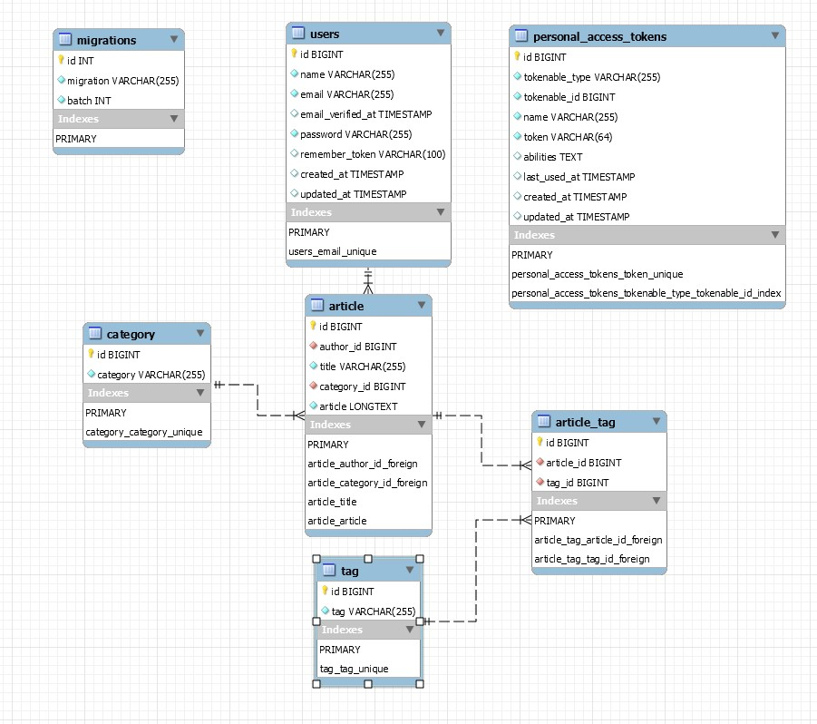

## About Blog RESTful APIs

### 使用情境

- 提供使用者新增、編輯、刪除自己的文章及類別之功能

### 架設說明

- 使用 Laravel 8 框架，搭配 Service-Repository-Model 架構
- 使用 Eloquent ORM 搭配 MySQL 資料庫
- 使用 Sanctum 作為 API 的認證機制
- 使用 darkaonline/l5-swagger 套件製作 API 文件
- 資料庫架構 

### API 文件大綱 (route: /api/documentation)

- **Article**
    - GET /article: 取得全部文章
    - GET /article/{id}: 取得特定 id 之文章
    - POST /article: 新增文章
    - PATCH /article/{id}: 編輯特定 id 之文章
    - DELETE /article/{id}: 刪除特定 id 之文章
- **Category**
    - GET /category: 取得全部類別
    - GET /category/{id}: 取得特定 id 之類別
    - POST /category: 新增類別
    - DELETE /category/{id}: 刪除特定 id 之類別
